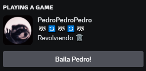

# Pedro Pedro Pedro

> This is a personal project made just for fun and learning

### This rust program shows the trending dancing racoon as your discord activity
It makes use of the open source discord game sdk written in rust [`⚔️ discord-sdk`](https://github.com/EmbarkStudios/discord-sdk)

### It looks as follows:

### Current features
- 11 frames of animation of the raccon spinning
- Random text status (in image: `Revolviendo 🗑️`)
- Button that links to a youtube video of the [dance](https://www.youtube.com/watch?v=F2YpXC1itEE)

### Anyone is free to try it out at their own risk :P